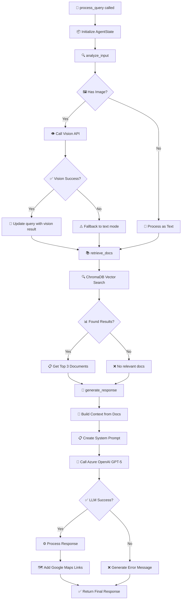
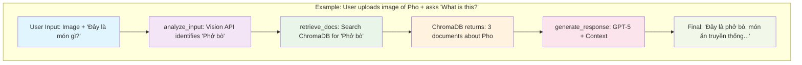
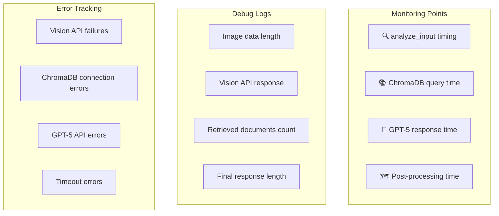
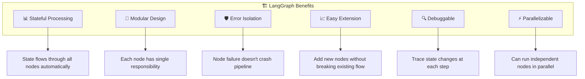

# LangGraph Workflow Flowchart - Travel AI Assistant

## 📊 Overall Architecture

```mermaid
graph TD
    A[🚀 User Input] --> B{📝 Input Type?}
    B -->|Text Only| C[📄 Text Query]
    B -->|Image + Text| D[🖼️ Image Data]
    B -->|Image Only| D
    
    C --> E[🔍 analyze_input Node]
    D --> E
    
    E --> F[📚 retrieve_docs Node]
    F --> G[🤖 generate_response Node]
    G --> H[✅ Final Response]
    
    subgraph "🏗️ LangGraph Workflow"
        E
        F  
        G
    end
    
    subgraph "📦 AgentState"
        I[messages: List[str]]
        J[query: str]
        K[query_type: str]
        L[image_data: str]
        M[retrieved_docs: List[str]]
        N[response: str]
    end
```

## 🔄 Detailed Node Processing

```mermaid
graph TD
    subgraph "🔍 Node 1: analyze_input"
        A1[Input State] --> B1{Has Image?}
        B1 -->|Yes| C1[🖼️ Call Vision API]
        B1 -->|No| D1[📄 Keep Text Query]
        
        C1 --> E1{Vision Success?}
        E1 -->|Yes| F1[✅ Update query with image analysis]
        E1 -->|No| G1[❌ Fallback to text processing]
        
        D1 --> H1[Set query_type = 'text']
        F1 --> I1[Set query_type = 'image'] 
        G1 --> H1
        
        H1 --> J1[Output State]
        I1 --> J1
    end
    
    subgraph "📚 Node 2: retrieve_docs"
        A2[Input State] --> B2[🔍 ChromaDB Search]
        B2 --> C2[📊 Vector Similarity]
        C2 --> D2[🔝 Top 3 Results]
        D2 --> E2{Results Found?}
        E2 -->|Yes| F2[✅ Update retrieved_docs]
        E2 -->|No| G2[❌ Empty retrieved_docs]
        F2 --> H2[Output State]
        G2 --> H2
    end
    
    subgraph "🤖 Node 3: generate_response"
        A3[Input State] --> B3[📋 Build Context]
        B3 --> C3[🔧 Create System Prompt]
        C3 --> D3[🚀 Call GPT-5]
        D3 --> E3{LLM Success?}
        E3 -->|Yes| F3[✅ Process Response]
        E3 -->|No| G3[❌ Error Response]
        
        F3 --> H3[🗺️ Add Google Maps Links]
        H3 --> I3[✅ Update response]
        G3 --> I3
        I3 --> J3[Output State]
    end
```



## 🎯 State Flow Through Nodes

```mermaid
graph LR
    subgraph "Initial State"
        A[messages: []]
        B[query: 'User input']
        C[query_type: 'text'] 
        D[image_data: base64 | null]
        E[retrieved_docs: []]
        F[response: '']
    end
    
    subgraph "After analyze_input"
        A1[messages: []]
        B1[query: 'Processed query']
        C1[query_type: 'text' | 'image']
        D1[image_data: base64 | null]
        E1[retrieved_docs: []]
        F1[response: '']
    end
    
    subgraph "After retrieve_docs"
        A2[messages: []]
        B2[query: 'Processed query']
        C2[query_type: 'text' | 'image']
        D2[image_data: base64 | null]
        E2[retrieved_docs: ['doc1', 'doc2', 'doc3']]
        F2[response: '']
    end
    
    subgraph "After generate_response"
        A3[messages: []]
        B3[query: 'Processed query']
        C3[query_type: 'text' | 'image']
        D3[image_data: base64 | null]
        E3[retrieved_docs: ['doc1', 'doc2', 'doc3']]
        F3[response: 'Final AI response']
    end
    
    A --> A1
    B --> B1
    C --> C1
    D --> D1
    E --> E1
    F --> F1
    
    A1 --> A2
    B1 --> B2
    C1 --> C2
    D1 --> D2
    E1 --> E2
    F1 --> F2
    
    A2 --> A3
    B2 --> B3
    C2 --> C3
    D2 --> D3
    E2 --> E3
    F2 --> F3
```

## 🔀 Decision Flow



## 🎮 Example Execution Flow



## 🛠️ Error Handling Flow

```mermaid
graph TD
    A[Node Execution] --> B{Error Occurs?}
    B -->|No| C[✅ Continue to Next Node]
    B -->|Yes| D{Which Node?}
    
    D -->|analyze_input| E[🖼️ Vision API Error]
    D -->|retrieve_docs| F[📚 ChromaDB Error]  
    D -->|generate_response| G[🤖 LLM API Error]
    
    E --> E1[Set fallback query]
    E1 --> H[Continue Pipeline]
    
    F --> F1[Set empty retrieved_docs]
    F1 --> H
    
    G --> G1[Set error response]
    G1 --> I[Return Error to User]
    
    H --> C
    C --> J[Next Node | END]
```

## 📈 Performance & Monitoring



## 🎯 Key Benefits Visualization


